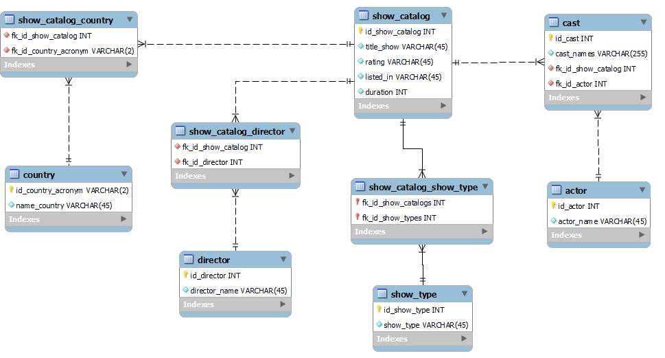

**Este projeto tem como objetivo analisar o dataset Netflix disponível na plataforma Kaggle. O dataset contém informações sobre filmes e séries disponíveis na plataforma Netflix, como título, data de adição, gênero, diretor, elenco, entre outros.**

O dataset Netflix foi utilizado neste projeto. O dataset pode ser baixado na plataforma **Kaggle**: *https://www.kaggle.com/datasets/syedmubarak/netflix-dataset-latest-2021*

*O dataset foi pré-processado e normalizado. As seguintes etapas foram realizadas:*

    -Conversão da coluna "date_added" para o formato DATE: A coluna "date_added" estava no formato "August 4, 2017", que não é  compatível com o tipo DATE no MySQL. Para converter a coluna para o formato DATE.

    -Conversão da coluna "release_year" para o tipo INT: A coluna "release_year" estava no tipo DATE na versão 1.0 do modelo físico. Para converter a coluna para o tipo INT.

    -Remoção do "s" da coluna "show_id": A coluna "show_id" tinha um "s" antes de todo o número do ID, removemos o "s" e mudamos o tipo da coluna para INT.

    -Conversão da coluna "title" para o tipo STRING: A coluna "title" tinha o tipo OBJECT, converter a coluna para o tipo STRING

    -Mudança de nome da coluna "TYPE" para "TYPE_SHOW": A coluna "TYPE" era uma palavra reservada do MySQL. Para evitar problemas, a coluna foi renomeada para "TYPE_SHOW" e o tipo da coluna foi alterado para STRING.

Para realizarmos todo esse processo, nosso grupo utilizou metodologias ágeis e fizemos um ROADMAP para melhor acompanhamento.
    Link para o ROADMAP: **https://miro.com/app/board/uXjVKRun7Dk=/**
